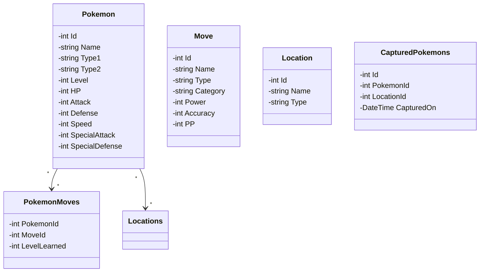
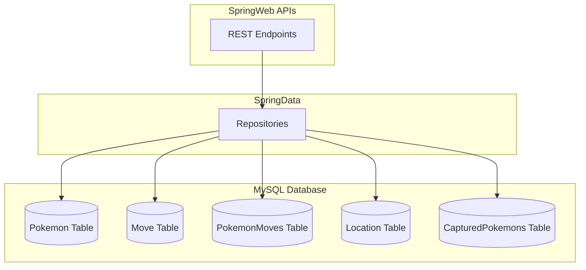

# UnovaJournal
A Pokémon White 2 Companion Tracker

<a href="https://github.com/DivyenduDutta/UnovaJournal/actions"></a>

CI uses
- SpotLess for code formatting
- SpotBugs for static analysis
- PMD for style/complexity analysis

#### For Developers

Run the below commands in local before pushing code to remote.

##### Code formatting
```bash
mvnw spotless:check
```

If there are formatting issues, run the below command to fix them.
```bash
mvnw spotless:apply
```

##### Static analysis
```bash
mvnw spotbugs:check
```

##### Style/complexity analysis
```bash
mvnw pmd:check
```

### Documentation

#### UML Diagram



#### System Architecture

